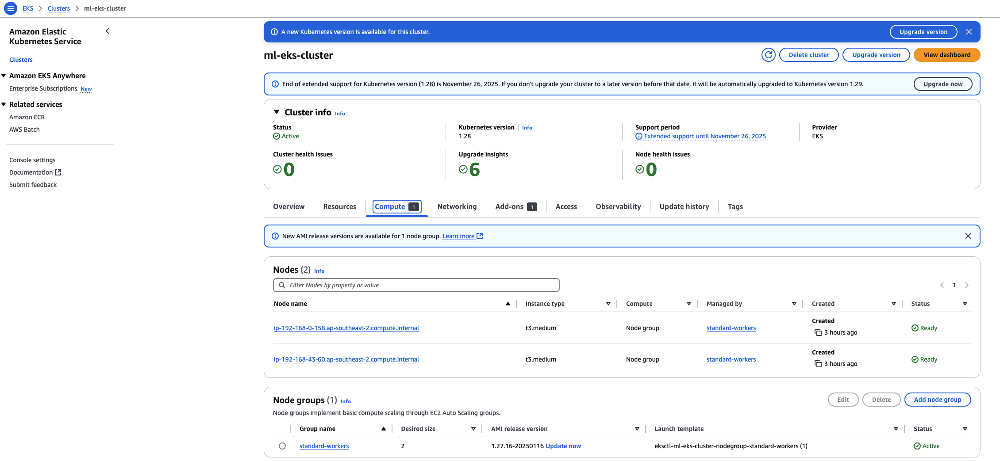
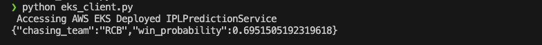

## Cloud Deployment 

### Setup

Upload docker image to ECR registry. 
Create a repository and push the docker image. Refer the image in the deployment.yaml

### EKS Cluster creation and k8s deployment

```
❯ export AWS_PROFILE=<aws-profile>  # AWS Profile

# Create cluster 
eksctl create cluster \
  --name ml-eks-cluster \
  --region ap-southeast-2 \
  --version 1.27 \
  --nodegroup-name standard-workers \
  --node-type t3.medium \
  --nodes 2 \
  --nodes-min 2 \
  --nodes-max 4


❯ eksctl get cluster
NAME            REGION          EKSCTL CREATED
ml-eks-cluster  ap-southeast-2  True

❯ k get nodes
NAME                                               STATUS   ROLES    AGE   VERSION
ip-192-x-0-158.ap-southeast-2.compute.internal   Ready    <none>   89m   v1.27.16-eks-aeac579
ip-192-x-43-60.ap-southeast-2.compute.internal   Ready    <none>   89m   v1.27.16-eks-aeac579

# Apply the deployment and services

❯ cd kube/eks  # Go to EKS directory.

❯ k apply -f chase-deployment.yaml

deployment.apps/chase-pred created

❯ k get deployments.apps
NAME         READY   UP-TO-DATE   AVAILABLE   AGE
chase-pred   1/1     1            1           24s

❯ k get svc
NAME             TYPE           CLUSTER-IP      EXTERNAL-IP                                                                    PORT(S)        AGE
chase-pred-svc   LoadBalancer   10.100.x.98   x-y-z.ap-southeast-2.elb.amazonaws.com   80:31395/TCP   6s


```

### Screenshots




### Testing
```
cd ../ipl_infer
pipenv shell
(ipl_infer) python eks_client.py
```



### Cleanup
```
eksctl delete cluster --name ml-eks-cluster --region ap-southeast-2
```
